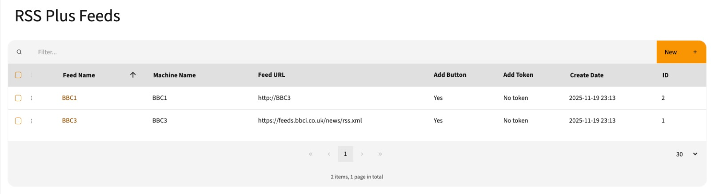
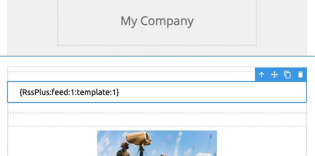

# Mautic Email RSS Plus Bundle


Advanced RSS feed management for Mautic emails with powerful GrapeJS integration and dynamic content tokens.

**Version:** 1.0.0
**Author:** Frederik Wouters
**License:** MIT

---

## 📋 Table of Contents

- [Overview](#overview)
- [Features](#features)
- [Requirements](#requirements)
- [Installation](#installation)
- [Configuration](#configuration)
- [Usage](#usage)
  - [Managing RSS Feeds](#managing-rss-feeds)
  - [Managing Templates](#managing-templates)
  - [GrapeJS Integration](#grapesjs-integration)
  - [RSS Plus Tokens](#rss-plus-tokens)
- [API Endpoints](#api-endpoints)
- [Token Format](#token-format)
- [Screenshots](#screenshots)
- [Development](#development)
- [Troubleshooting](#troubleshooting)

---

## 🎯 Overview

The **Mautic Email RSS Plus Bundle** extends Mautic's email capabilities by providing advanced RSS feed management with seamless GrapeJS builder integration. Create reusable MJML templates, import RSS content directly into your emails, or use dynamic tokens for runtime content replacement.

### What Makes It "Plus"?

Unlike basic RSS imports, RSS Plus offers:
- **Multiple RSS Feeds** - Manage unlimited feeds from different sources
- **Custom MJML Templates** - Design how each RSS item appears
- **Per-Item Template Selection** - Different items can use different templates
- **GrapeJS Native Integration** - Drag-and-drop RSS blocks directly in the email builder
- **Dynamic Tokens** - Insert placeholders that resolve at send-time
- **Template Management** - Reusable MJML templates for consistent styling

---

## ✨ Features

### 🗂️ Feed Management
- Create and manage multiple RSS feeds
- Configure custom field extraction (title, link, description, media, etc.)
- Machine names for programmatic access
- Button text customization
- Token-based identification

### 🎨 Template Management
- MJML template editor with syntax highlighting
- Token-based field replacement (`{title}`, `{description}`, `{media}`, etc.)
- Reusable templates across multiple feeds
- Live preview support (planned)

### 🎨 GrapeJS Integration

#### RSS Feed Blocks
- One draggable block per RSS feed in "RSS Plus Feeds" category
- Modal selector for choosing specific RSS items
- Per-item template selection
- Multi-item import with different templates

#### RSS Plus Token Block
- Located in "Extra" category
- Dynamic token insertion for runtime content
- Configure feed and template via modal
- Perfect for scheduled/automated emails

### 🔌 API Integration
- RESTful endpoints for feeds and templates
- JSON responses for easy integration
- Authentication-protected public routes

---

## 📦 Requirements

- **PHP:** >= 8.0
- **Mautic:** >= 4.x (tested on 5.x)
- **Database:** MySQL/MariaDB
- **GrapeJS:** Email Builder with MJML support

---

## 🚀 Installation

### Method 1: Manual Installation

1. **Clone or download** the bundle to your Mautic plugins directory:
   ```bash
   cd /path/to/mautic/plugins
   git clone https://github.com/yourusername/MauticEmailRssPlusBundle.git
   ```

2. **Clear Mautic cache:**
   ```bash
   php -d memory_limit=512M bin/console cache:clear
   ```

3. **Reload plugins:**
   ```bash
   php -d memory_limit=512M bin/console mautic:plugins:reload
   ```

4. **Run database migrations:**
   ```bash
   php -d memory_limit=512M bin/console doctrine:migrations:migrate --no-interaction
   ```

5. **Enable the plugin:**
   - Navigate to Mautic Settings → Plugins
   - Find "RSS Plus" in the list
   - Click to open and set "Published" to "Yes"
   - Save

### Method 2: Composer (if published)

```bash
composer require mautic/email-rss-plus-bundle
php bin/console cache:clear
php bin/console mautic:plugins:reload
php bin/console doctrine:migrations:migrate
```

---

## ⚙️ Configuration

### Enable the Integration

1. Go to **Settings → Plugins**
2. Find "RSS Plus" and click to configure
3. In the **Features** tab, enable the integration
4. Click **Save & Close**


### Access RSS Plus

Once enabled, you'll see the **RSS Plus** menu in your Mautic admin panel with two sections:
- **Feeds** - Manage RSS feed sources
- **Templates** - Manage MJML templates

---

## 📖 Usage

### Managing RSS Feeds



#### Create a New Feed

1. Navigate to **RSS Plus → Feeds**
2. Click **New** button
3. Configure feed settings:

   | Field | Description | Example |
   |-------|-------------|---------|
   | **Name** | Display name for the feed | "Tech News Feed" |
   | **Machine Name** | Unique identifier (alphanumeric, underscores) | `tech_news_feed` |
   | **RSS URL** | Full URL to the RSS/XML feed | `https://feeds.example.com/tech` |
   | **RSS Fields** | Field names to extract (one per line) | `title`<br>`link`<br>`description`<br>`media`<br>`pubDate`<br>`category` |
   | **Button Text** | CTA button text in emails | "Read More" |
   | **Token** | Optional custom token | `tech-news` |

4. Click **Save & Close**


#### Supported RSS Fields

The bundle automatically extracts common RSS fields and supports namespaced elements:

- `title` - Article title
- `link` - Article URL
- `description` - Article summary/content
- `pubDate` - Publication date
- `category` - Article category/tags
- `media` - Featured image (from `media:content`, `media:thumbnail`, or `enclosure`)
- Any custom field in your RSS feed

---

### Managing Templates


#### Create a New Template

1. Navigate to **RSS Plus → Templates**
2. Click **New** button
3. Enter template details:
   - **Name:** Template identifier (e.g., "Featured Article Card")
   - **Content:** MJML markup with token placeholders

4. Click **Save & Close**

#### Template Syntax

Templates use MJML with token-based field replacement. Tokens are wrapped in curly braces:

**Example Template:**

```xml
<mj-section background-color="#ffffff" padding-top="25px" padding-bottom="0">
  <mj-column width="100%">
    <mj-image
      src="{media}"
      alt="{title}"
      padding-top="0"
      padding-bottom="20px">
    </mj-image>

    <mj-text
      color="#000000"
      font-family="Ubuntu, Helvetica, Arial, sans-serif"
      font-size="20px"
      line-height="1.5"
      font-weight="500"
      padding-bottom="0px">
      <p>{title}</p>
    </mj-text>

    <mj-text
      color="#000000"
      font-family="Ubuntu, Helvetica, Arial, sans-serif"
      font-size="16px"
      line-height="1.5"
      font-weight="300"
      align="justify">
      <p>{description}</p>
    </mj-text>

    <mj-button
      background-color="#486AE2"
      color="#FFFFFF"
      href="{link}"
      font-family="Ubuntu, Helvetica, Arial, sans-serif"
      padding-top="20px"
      padding-bottom="40px">
      READ MORE
    </mj-button>

    <mj-text
      color="#666666"
      font-family="Ubuntu, Helvetica, Arial, sans-serif"
      font-size="12px">
      <p>{category} - {pubDate}</p>
    </mj-text>
  </mj-column>
</mj-section>
```

#### Available Tokens

Use any RSS field as a token by wrapping it in curly braces:
- `{title}` - Article title
- `{link}` - Article URL
- `{description}` - Article description
- `{media}` - Featured image URL
- `{pubDate}` - Publication date
- `{category}` - Category/tags
- `{custom_field}` - Any custom RSS field you've configured

---

### GrapeJS Integration

The bundle provides two types of blocks in the GrapeJS email builder:

#### 1. RSS Feed Blocks (Immediate Content)


Use these to import RSS content directly into your email during composition:

1. **Open** the GrapeJS email builder
2. **Locate** the "RSS Plus Feeds" category in the blocks panel
3. **Drag** a feed block into your email
4. A modal opens showing available RSS items:
   - Check the items you want to include
   - Select a template for each item using the dropdown
   - Click **"Insert Selected Items"**
5. The content is immediately rendered with your chosen templates

**Features:**
- Select multiple items at once
- Each item can use a different template
- Select All / Deselect All buttons
- Preview item title, date, and description

**Use Cases:**
- Manual email newsletters
- Curated content emails
- One-time campaign emails

#### 2. RSS Plus Token Block (Dynamic Content)


Use this for dynamic content that updates at send-time:

1. **Open** the GrapeJS email builder
2. **Find** "RSS Plus Token" in the "Extra" category
3. **Drag** the token block into your email
4. A modal opens with two dropdowns:
   - **Select Feed** - Choose your RSS source
   - **Select Template** - Choose the MJML template
   - Click **"Insert Token"**
5. A placeholder token is inserted: `{RssPlus:feed:1:template:2}`

**Features:**
- Content updates automatically at send-time
- Perfect for scheduled/recurring emails
- No manual content selection needed
- Always shows the latest RSS items

**Use Cases:**
- Daily digest emails
- Automated newsletters
- Scheduled campaign emails
- Recurring content updates



---

## 🔌 API Endpoints

The bundle exposes several public API endpoints:

### Get All Feeds
```http
GET /rssplus/feeds/list
```

**Response:**
```json
{
  "success": true,
  "feeds": [
    {
      "id": 1,
      "name": "Tech News",
      "machineName": "tech_news",
      "rssUrl": "https://feeds.example.com/tech",
      "rssFields": "title\nlink\ndescription\nmedia",
      "button": "Read More",
      "token": "tech-news"
    }
  ]
}
```

### Get All Templates
```http
GET /rssplus/templates/list
```

**Response:**
```json
{
  "success": true,
  "templates": [
    {
      "id": 1,
      "name": "Featured Article Card",
      "content": "<mj-section>...</mj-section>"
    }
  ]
}
```

### Fetch RSS Items
```http
GET /rssplus/rss/fetch/{feedId}
```

**Response:**
```json
{
  "success": true,
  "feedName": "Tech News",
  "items": [
    {
      "title": "Breaking Tech News",
      "link": "https://example.com/article",
      "description": "Article summary...",
      "media": "https://example.com/image.jpg",
      "pubDate": "2024-01-20",
      "category": "Technology"
    }
  ],
  "template": "<mj-section>...</mj-section>"
}
```

---

## 🎫 Token Format

RSS Plus tokens follow this format:

```
{RssPlus:feed:FEED_ID:template:TEMPLATE_ID}
```

### Examples

```
{RssPlus:feed:1:template:1}
{RssPlus:feed:5:template:3}
```

### How Tokens Work

1. **At Send Time:** Mautic processes the email content
2. **Token Detection:** RSS Plus identifies `{RssPlus:...}` tokens
3. **Content Fetch:** The latest RSS items are fetched from the specified feed
4. **Template Application:** Each item is rendered using the specified template
5. **Token Replacement:** The token is replaced with rendered MJML content
6. **Email Delivery:** The final email contains fresh RSS content

### Token Placement

Tokens are automatically wrapped in MJML sections:

```xml
<mj-section>
  <mj-text color="#000000" font-family="" font-size="16px" line-height="1.5" font-weight="300" align="justify">
    {RssPlus:feed:1:template:1}
  </mj-text>
</mj-section>
```

---

## 📸 Screenshots

| Feature | Screenshot |
|---------|-----------|
| Admin Menu |  |
| Feeds Overview |  |
| Edit Feed |  |
| Templates |  |
| GrapeJS Content Selection |  |
| Token Configuration |  |
| Token in Editor |  |

---

## 🛠️ Development

### Project Structure

```
MauticEmailRssPlusBundle/
├── Assets/
│   ├── css/
│   │   └── rssplus.css           # Styling for modals and UI
│   ├── js/
│   │   └── grapesjs-rssplus.js   # GrapeJS plugin
│   ├── img/                       # Screenshots
│   └── rss-icon.png               # Plugin icon
├── Config/
│   └── config.php                 # Routes, services, menu
├── Controller/
│   ├── ApiController.php          # Feeds API
│   ├── FeedController.php         # Feed CRUD
│   ├── RssController.php          # RSS fetching
│   ├── TemplateApiController.php  # Templates API
│   └── TemplateController.php     # Template CRUD
├── Entity/
│   ├── RssPlusFeed.php           # Feed entity
│   ├── RssPlusFeedRepository.php
│   ├── RssPlusTemplate.php        # Template entity
│   └── RssPlusTemplateRepository.php
├── EventListener/
│   └── AssetSubscriber.php        # Asset injection
├── Form/
│   └── Type/
│       ├── FeedType.php           # Feed form
│       └── TemplateType.php       # Template form
├── Integration/
│   └── EmailRssPlusIntegration.php # Mautic integration
├── Migration/
│   └── Version20250119000000.php  # Database schema
├── Model/
│   ├── FeedModel.php              # Feed business logic
│   └── TemplateModel.php          # Template business logic
├── Resources/
│   └── views/
│       ├── Feed/                  # Feed views
│       └── Template/              # Template views
├── Translations/
│   └── en_US/
│       └── messages.ini           # English translations
├── composer.json                  # Composer config
├── MauticEmailRssPlusBundle.php  # Bundle entry point
└── README.md                      # This file
```

### Database Schema

**Table: `rssplus_feeds`**
- `id` - Primary key (auto-increment)
- `name` - Feed display name (string 255)
- `machine_name` - Unique identifier (string 255)
- `rss_url` - RSS feed URL (string 500)
- `rss_fields` - Fields to extract (text, newline-separated)
- `button` - Button text (string 255)
- `token` - Custom token (string 255)
- `created_at`, `created_by`, `updated_by` - Audit fields

**Table: `rssplus_templates`**
- `id` - Primary key (auto-increment)
- `name` - Template name (string 255)
- `content` - MJML template content (text)
- `created_at`, `updated_at`, `updated_by` - Audit fields

### Key Components

#### GrapeJS Plugin (`Assets/js/grapesjs-rssplus.js`)

The JavaScript plugin registers:
- RSS feed blocks (dynamic, one per feed)
- RSS Plus Token block (in Extra category)
- Modal interfaces for content/token selection
- Event listeners for drag-and-drop
- API calls for feeds and templates

#### Event Subscriber (`EventListener/AssetSubscriber.php`)

Injects CSS and JavaScript assets into GrapeJS builder pages.

#### Integration (`Integration/EmailRssPlusIntegration.php`)

Defines the Mautic plugin integration with:
- Enable/disable toggle
- Icon configuration
- Feature settings


---

## 📝 License

This project is licensed under the **MIT License**.

```
MIT License

Copyright (c) 2024 Frederik Wouters

Permission is hereby granted, free of charge, to any person obtaining a copy
of this software and associated documentation files (the "Software"), to deal
in the Software without restriction, including without limitation the rights
to use, copy, modify, merge, publish, distribute, sublicense, and/or sell
copies of the Software, and to permit persons to whom the Software is
furnished to do so, subject to the following conditions:

The above copyright notice and this permission notice shall be included in all
copies or substantial portions of the Software.

THE SOFTWARE IS PROVIDED "AS IS", WITHOUT WARRANTY OF ANY KIND, EXPRESS OR
IMPLIED, INCLUDING BUT NOT LIMITED TO THE WARRANTIES OF MERCHANTABILITY,
FITNESS FOR A PARTICULAR PURPOSE AND NONINFRINGEMENT. IN NO EVENT SHALL THE
AUTHORS OR COPYRIGHT HOLDERS BE LIABLE FOR ANY CLAIM, DAMAGES OR OTHER
LIABILITY, WHETHER IN AN ACTION OF CONTRACT, TORT OR OTHERWISE, ARISING FROM,
OUT OF OR IN CONNECTION WITH THE SOFTWARE OR THE USE OR OTHER DEALINGS IN THE
SOFTWARE.
```

---

## 🤝 Contributing

Contributions are welcome! Please follow these steps:

1. Fork the repository
2. Create a feature branch (`git checkout -b feature/amazing-feature`)
3. Commit your changes (`git commit -m 'Add amazing feature'`)
4. Push to the branch (`git push origin feature/amazing-feature`)
5. Open a Pull Request

---

## 🎉 Acknowledgments

- Built for [Mautic](https://www.mautic.org/) - Open Source Marketing Automation
- Inspired by the need for flexible RSS content in email campaigns
- Thanks to the Mautic community for feedback and testing

---

**Made with ❤️ for Mautic**
